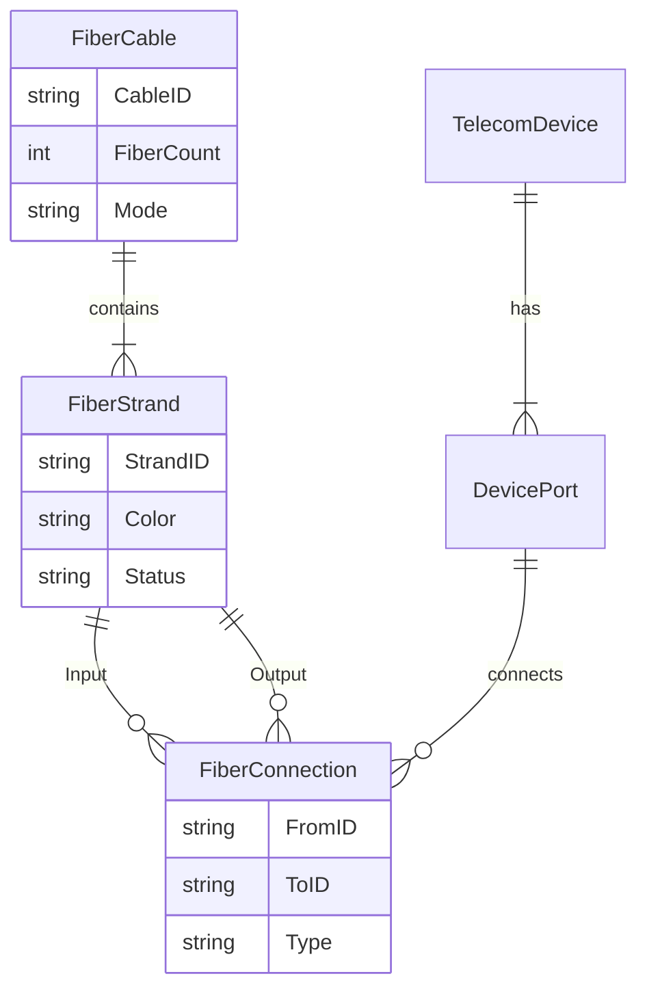

# Fiber Optic Network Management (GIS)


An enterprise-grade GIS solution for managing fiber optic networks using **ArcGIS Pro** and **Python**. This project implements a high-fidelity "Digital Twin" of the network, modeling not just the physical cables but the logical connectivity of individual fiber strands.

## 🚀 Key Features

*   **Utility Network Logic:** Implements sophisticated connectivity rules (Signal flow from OLT -> Splitter -> ONU).
*   **Non-Spatial Object Management:** Tracks individual fiber strands and equipment ports using related tables, keeping the map clean.
*   **Automation:** Python Toolbox (`.pyt`) to automate tedious tasks like "blowing fiber" (generating strand records).
*   **Recursive Tracing:** Algorithms to trace signal paths through complex splices and patches.

## 🛠️ Technology Stack

*   **Core GIS:** ArcGIS Pro 3.x / ArcPy
*   **Database:** File Geodatabase (GDB) - *Schema compatible with Enterprise Geodatabase*
*   **Scripting:** Python 3

## 📊 Data Model

This project uses a relational model to link physical assets (Cables) to logical assets (Strands).



## 📦 Installation & Setup

1.  **Clone the Repository:**
    ```bash
    git clone https://github.com/yourusername/fiber-network-gis.git
    ```
2.  **Generate the Geodatabase:**
    Open ArcGIS Pro, open the Python Window, and run:
    ```python
    import sys
    sys.path.append(r"path\to\fiber-network-gis\src\scripts")
    import setup_geodatabase
    setup_geodatabase.setup_geodatabase(r"path\to\output_folder")
    ```
3.  **Load the Toolbox:**
    *   In the **Catalog Pane**, right-click **Toolboxes** > **Add Toolbox**.
    *   Select `src/toolbox/FiberTools.pyt`.

## 📖 Usage Guide

### 1. Creating Network Assets
Use standard ArcGIS Pro editing tools to draw `FiberCable` lines and `TelecomDevice` points.

### 2. "Blowing" Fiber
1.  Select a cable on the map.
2.  Run the **Expand Cable to Strands** tool.
3.  The system automatically generates the corresponding 12, 24, or 144 strand records in the `FiberStrand` table.

### 3. Splicing
Use the **Connect Entities** tool to create logic connections:
*   **Splice:** Connect Strand A (Distribution) to Strand B (Drop).
*   **Patch:** Connect Port 1 (OLT) to Patch Panel Port A.

---

## 📄 License
This project is licensed under the MIT License - see the [LICENSE](LICENSE) file for details.
